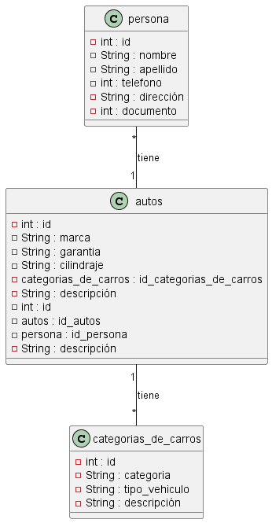

# jojoj

#### jdsajdbsajdbsajdbsajsajaskdjsabdjkbaskdjbasdj`sdadkj`

#### requerimekekn

1. RF 1:

1. RNF 1:

#### diase nm

`cateasd `

se necetita almcae id palasd tioppaksdi 

| id | marca | tipo|
|----|-------|-----|
| 1  | bmw   | todo|
| 2  | bmw   |


> Script de la base de datos
```sql
 drop database if exists  parcial;

 bashdbasjdbajsdbi


 

 
```



[ver](https://trello.com/b/lInsAP0U/proyecto-de-carros)
